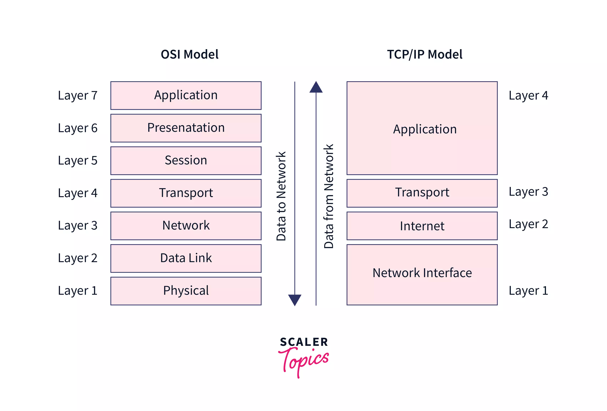

# Week 1 - HTTP (basic)

### 1강) HTTP

* Hypertext Transfer Protocol
  * Protocol : 규약, 약속
  * 컴퓨터 네트워크로 통신할 때에 사용하는 규약
*   Application Layer

    <figure><figcaption>
Open System Interconnection Model &#x26; TCP/IT Model
</figcaption></figure>

    * 본 강의에서 중요하게 보는 레이어는 2, 3, 4, 7
      1. Physical : 아예 HW 적인 부분 (컴퓨터 부품 등)
      2. Data Link : 다른 device(HW)와 통신할 때 각 device를 정의할 수단 (MAC address)
      3. Network : 떨어져있는 device를 인식할 수 있는 주소 (IP address)
      4. Transport : 해당 주소에서 어떤 프로그램을 찾아가면 되는지 인식 (Port number)
         * TCP (Transmission Control Protocol)
           * 전송 제어 프로토콜. 전화와 같다.
           * 수신자와 송신자간 '연결'이 필요
           * 데이터 전달 여부 및 순서 확인을 보장
         * UDP (User Diagram Protocol)
           * 편지-메일와 같음
           * 수신자와 연결하지 않은 상태에서도 송신자는 데이터를 보냄
           * 데이터 전달 여부 및 전달 순서는 보장할 수 없음 (수신자는 못 받았을 수 있음)
      5. Session : 통신을 관리하기 위하여 통신 사용자(수신자)들 정보를 송신자와 동기화함
         1. 과거에서는 서버에서 세션 객체를 만들어서 관리했지만, 요즘은 JWT와 같은 token을 이용하여 사용자들을 관리함
      6. Presentation : 사용자 시스템에서 인식할 수 있는 데이터 형식으로 송신자가 보낸 데이터를 표현해줌.
         1. 인코딩-디코딩, 암호화 등
      7. Application : HTTP,  FTP와 같은 실제 규약을 통한 요청 - 응답을 통한 작업 실행
      8. 그 외
         1. HTTPS를 위한 TLC(Transport Layer Security) 레이어 등을 별도로 정의하기도 함 (Application Layer - Network Layer 사이)
* HTTP 통신 과정 요약
  * Client - Server 간에 아래의 순서로 서로를 인식하여 소통함
    * IP -> TCP -> (TLS) -> HTTP -> HTML/CSS/JavaScript/Web APIs\
      &#x20;    \-> UDP -> DNS  ->
    * 서비스, 리소스(HTTP 요청 대상) 요청은 URL로 진행
  * HTTP is stateless
    * HTTP만 봐서는 이전에 만났던 그  Client가 맞는지 Server는 알 수 없음
      * \-> HTTP는 각각에 요청에 독립적임을 알 수 있음
    * 이전에 만났던 Client가 맞는지 확인하는 방법 : Request, Response Header로 소통
      * 데이터는 Server에 담겨 있지만..
      * 쿠키 : Token(key) 관리 가능 - 세션 역할
      * Brower Local Storage : 그 외 보안성 덜한 파일들
  * HTTP Message
    * 어떤 형태로든 전송 가능하나 가급적 사람이 읽을 수 있게 보냄
    * 요청 - 응답은 동일하게 아래와 같은 구조를 가짐
      * Start line
      * Headers
        * Client의 상태나 특징 확인 (토큰 등을 통해)
      * Blank line
        * 빼먹으면 body 시작을 알 수 없음
      * Body
        * Header에서 Content-Length로 길이를 미리 정의하지 않으면, Client는 Body의 끝이 어디인지 알 수 없음
  * HTTP Method (HTML 1.1)
    * GET (Read) : 멱등성이 있어 동일 요청 반복 시 늘 같은 결과를 얻음 (같은 환경에서)
    * HEAD (Read) : Body 없이 Head만 받음 (캐시 만료 여부 확인, 권한 얻기, Status만 받기)
    * Post (Create) : Submit, 단 멱등성이 없어 동일 요청 반복 시 같은 결과를 얻는다는 보장 없음
    * PUT (Update) : Overwrite, 보낸 것으로 기존 내용을 대체하며 멱등성이 있음 (늘 같은 결과)
    * PATCH (Update) : Partial Update, 특정 항목만 바꾸기가 가능하나 요청 내용에 따라 멱등성 없을 수 있음 (기존 값 +10씩 하는 경우 등)
    * DELETE (Delete)
    * OPTIONS : Header 정보, POST/PUT 등 메소드 사용 가능 여부 확인
  * HTTP Response
    * Status code + Status message의 형태
      * Status code가 중요, message는 그 자체가 통신 과정에서 사용하는 정보는 아님
      * Status code
        * 1xx : Information
        * 2xx : Success (200, 201, 204)
        * 3xx : Redirection (요즘은 304 NOT MODIFIED 만 뜸. 새로고침 해도 바뀐 내용이 없어서 가져올 데이터가 없는경우)
        * 4xx : Client Error (404, 401, ...)
        * 5xx : Server Error

### 2강) HTTP Client

* TCP/IP 통신 : Internet Protocol Suite (컴퓨터 인터넷은 TCP/IP 통신을 활용함)
  * 송신자 - 수신자 간 연결 보장을 위하여 Socket을 사용함
* Berkely Socket (API)
  * Socket 프로그래밍을 위한 API
* (Network) Socket
  * 각 네트워크 프로세스간 통신의 종착점 (전화기의 스피커와 같음)
  * Socket은 File과 유사하게 다룰 수 있음
    * 실제로 UNIX에서는 socket을 file descriptor의 일종으로 사용
    * 예전에 Ubuntu에서 socket 관련 설정을 할 때, 파일 시스템에서 조회 가능했던 것으로 기억함
  * Java의 IO Stream으로 다루기 편함 (개념이 유사함)
* TCP 통신 순서 (전화 받기와 비슷)
  * Listen -> Connect -> Accept -> Send & Receive (반복) -> Close (Client는 Close 사실을 Receive를 통해 알 수 있음)
  * 보통 서버는 최초 요청 받기용 소켓(ServerSocket)과, 특정 클라이언트 대응용 소켓(Socket)을 따로 만든다.
* **HTTP Client의 통신 순서**
  * Connect -> Send & Receive -> Close(Receive)
  * 항상 서버로부터 Respose를 받고, 서버로 Request를 보냄냄
* Client Socket 개발 과정 꿀팁 메모
  * Terminal에서 idea . -> IntelliJ에서 바로 프로젝트 오픈 가능
  * Ctrl + Shift + T : 일반 앱 클래스에서 테스트 클래스로, 테스트 클래스에서 일반 앱 클래스로 바로 이동 가능
  * Alt + Enter : 빨간줄 쳐졌을 때 빠른 대응을 위한 선택지 띄우기 가능
  * 프로젝트 새로 만들 때마다 Actions On Save 설정하기 : import 최적화만 해도 큰 도움
  *   케이스별 사용 Class

      * (Client) Socket : Socket
        * Closeable이어서, try-with-resources 가능\
          (try문 안에서만 해당 객체를 사용하고 try문 끝나면 자동 close 가능)
      * Byte Array로 데이터 송수신 : InputStream, OutputStream
        * 들어온 순서 그대로 데이터를 받아들이면 됨\
          (대신 inputStream.read() 등으로읽은 값을 변수로 저장하지 않으면 날아감)
        * 좀더 세부 절차가 번거로움
          * 미리 정의한 Byte Array 크기가 Chunk(작업단위)의 크기가 됨
          * Chunk보다 큰 데이터가 한번에 들어오면 여러번 나누어서 값을 읽어들이게 할 수 있음
      * CharBuffer로 데이터 송수신 : InputStreamReader(Reader class 상속), OutputStreamWriter(Writer class 상속)
        * 좀더 절차가 간소화(Array 사이즈 조절 절차 X)되나, charBuffer.flip(); 을 넣어주어야 사람이 볼 수 있는 데이터 송수신 가능
        * CharBuffer도 Chunk 크기를 정의할 수 있으며, Chunk보다 큰 데이터가 한번에 들어오면 여러번 나누어서 값을 읽어들이게 할 수 있음

### 3강) HTTP Server

* **HTTP Server의 통신 순서**
  * Listen (Server on) -> Accept -> Send & Receive -> Close (Server off)
    * Blocking : 서버가 listen하는동안 client로부터의 I/O를 기다리는 작업\
      (파일 읽기-쓰기도 블로킹의 일종. 소켓 만들기-닫기가 그와 같다는 점을 이해하자.)
      * Blocking 작업 중의 자원 비효율을 개선하기 위하여, Multithread, Async, event 기반 처리가 필요
    * 항상 클라이언트로부터 Request를 받고, 클라이언트로 Response를 보냄
* 케이스별 사용 Class
  * 대부분 Client와 용례가 비슷
  * ServerSocket : Device의 IP에서 특정 Port를 열어두고 Client의 Connect 요청을 기다림
    * Socket class를 상속한 것이 아님
    * 생성자에 포트 번호와 backlog 수치를 기입
      * backlog : 해당 서버의 Client queue(대기줄)에 세울 최대 Client 수\
        (기본값은 50)
    * Response를 보내줄 때에도 기본적인 헤더 작성을 하는 것이 좋음
      * Content-Type : text/plain와  text/html는 브라우저에서 다른 폰트로 출력함
      * Content-Length : 지정해주지 않으면 클라이언트는 body의 끝을 알 수 없음
        * 일반 Text length로 작성하면 안되고, byte array로 변환 후 해당 array의 length를 작성하여야 함
        * Content-Length 작성하지 않는 경우, 가급적 body 가장 아래에 줄바꿈 문자(\n)를 추가해 주자.

### 4강) Java HTTP Server

* 목요일에 업뎃 예정li

